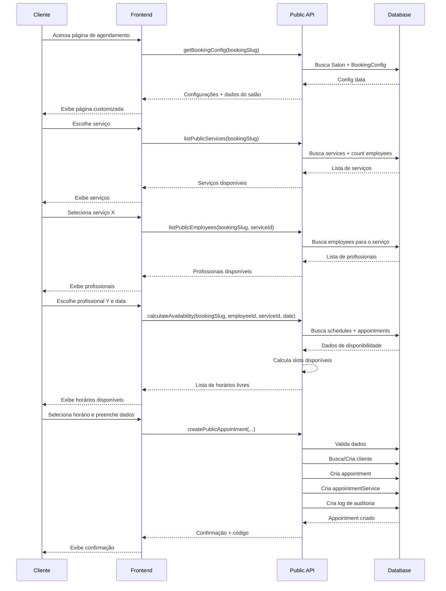

# Public Booking Operations Module

Sistema de agendamento online público para o Glamo - permite que clientes agendem serviços sem necessidade de autenticação.

## 📋 Índice

- [Visão Geral](#visão-geral)
- [Operações Públicas](#operações-públicas)
  - [1. getBookingConfig](#1-getbookingconfig)
  - [2. listPublicServices](#2-listpublicservices)
  - [3. listPublicEmployees](#3-listpublicemployees)
  - [4. calculateAvailability](#4-calculateavailability)
  - [5. createPublicAppointment](#5-createpublicappointment)
- [Funções Auxiliares](#funções-auxiliares)
- [Fluxo de Agendamento](#fluxo-de-agendamento)
- [Validações](#validações)
- [Integração](#integração)

## Visão Geral

O módulo de Public Booking Operations fornece uma API pública (sem autenticação) para agendamento online. Clientes podem:

1. Visualizar configurações e informações do salão
2. Listar serviços disponíveis
3. Listar profissionais que realizam cada serviço
4. Calcular horários disponíveis
5. Criar agendamentos

**Características:**
- ✅ **Sem autenticação** - Operações totalmente públicas
- ✅ **Validações robustas** - Verificação de disponibilidade, conflitos e dados
- ✅ **Busca/criação de clientes** - Automaticamente gerencia cadastro de clientes
- ✅ **Códigos de confirmação** - Cada agendamento recebe um código único
- ✅ **Audit logging** - Todas as ações são registradas
- ✅ **Customizações** - Suporta duração e preço customizados por profissional

## Operações Públicas

### 1. getBookingConfig

Obtém configurações de agendamento online do salão.

**Tipo:** Query pública (sem auth)

**Input:**
```typescript
{
  bookingSlug: string;  // URL slug do salão (ex: "salon-glamour")
}
```

**Output:**
```typescript
{
  config: {
    id: string;
    enableOnlineBooking: boolean;
    bookingPageTitle: string | null;
    bookingPageDescription: string | null;
    bookingPageLogo: string | null;
    bookingPageBanner: string | null;
    bookingPagePrimaryColor: string;
    bookingPageTheme: string;
    requireClientRegistration: boolean;
    collectClientPhone: boolean;
    collectClientEmail: boolean;
    collectClientNotes: boolean;
    showProfessionalPhotos: boolean;
    showServicePrices: boolean;
    enableServiceSelection: boolean;
    enableProfessionalChoice: boolean;
    requireTermsAcceptance: boolean;
    bookingTermsText: string | null;
    minAdvanceHours: number;
    maxAdvanceDays: number;
    allowSameDayBooking: boolean;
    salon: {
      id: string;
      name: string;
      description: string | null;
      address: string | null;
      city: string | null;
      state: string | null;
      phone: string | null;
      email: string | null;
    };
  };
}
```

**Validações:**
- ✅ Salon existe e slug é válido
- ✅ BookingConfig existe
- ✅ enableOnlineBooking = true
- ✅ Salon não está deletado

**Exemplo de uso:**
```typescript
import { getBookingConfig } from 'wasp/client/operations';

const result = await getBookingConfig({ 
  bookingSlug: 'salon-glamour' 
});

console.log(result.config.salon.name); // "Salon Glamour"
console.log(result.config.minAdvanceHours); // 2
```

---

### 2. listPublicServices

Lista serviços disponíveis para agendamento online.

**Tipo:** Query pública (sem auth)

**Input:**
```typescript
{
  bookingSlug: string;
}
```

**Output:**
```typescript
{
  services: Array<{
    id: string;
    name: string;
    description: string | null;
    duration: number;  // em minutos
    price: number;
    employeeCount: number;  // Quantos profissionais podem fazer
  }>;
}
```

**Validações:**
- ✅ Salon existe e online booking ativo
- ✅ Retorna apenas serviços ativos (deletedAt = null, isActive = true)
- ✅ Retorna apenas serviços com pelo menos 1 employee ativo disponível
- ✅ Employee deve ter: isActive = true, acceptsOnlineBooking = true

**Lógica:**
1. Busca salon por bookingSlug
2. Busca todos os services ativos do salon
3. Para cada service, conta employees disponíveis:
   - isActive = true
   - acceptsOnlineBooking = true
   - deletedAt = null
   - Têm EmployeeService para esse serviço
4. Filtra services com employeeCount > 0
5. Ordena por name ASC

**Exemplo de uso:**
```typescript
import { listPublicServices } from 'wasp/client/operations';

const result = await listPublicServices({ 
  bookingSlug: 'salon-glamour' 
});

result.services.forEach(service => {
  console.log(`${service.name} - R$ ${service.price} - ${service.duration}min`);
  console.log(`${service.employeeCount} profissionais disponíveis`);
});
```

---

### 3. listPublicEmployees

Lista profissionais disponíveis para um serviço específico.

**Tipo:** Query pública (sem auth)

**Input:**
```typescript
{
  bookingSlug: string;
  serviceId: string;
}
```

**Output:**
```typescript
{
  employees: Array<{
    id: string;
    name: string;
    profilePhoto: string | null;
    bio: string | null;
    specialties: string[];
    customDuration?: number;  // Se tiver customização
    customPrice?: number;     // Se tiver customização
  }>;
}
```

**Validações:**
- ✅ Salon existe e online booking ativo
- ✅ Service existe e pertence ao salon
- ✅ Service está ativo
- ✅ Retorna apenas employees ativos com acceptsOnlineBooking = true
- ✅ Employees devem ter EmployeeService para o serviceId

**Lógica:**
1. Busca salon por bookingSlug
2. Valida que service existe e pertence ao salon
3. Busca EmployeeService records para o serviceId
4. Filtra employees que:
   - isActive = true
   - acceptsOnlineBooking = true
   - deletedAt = null
5. Inclui customDuration e customPrice do EmployeeService (se existir)
6. Ordena por name ASC

**Exemplo de uso:**
```typescript
import { listPublicEmployees } from 'wasp/client/operations';

const result = await listPublicEmployees({ 
  bookingSlug: 'salon-glamour',
  serviceId: 'service-123'
});

result.employees.forEach(emp => {
  console.log(`${emp.name} - ${emp.specialties.join(', ')}`);
  if (emp.customDuration) {
    console.log(`Duração customizada: ${emp.customDuration}min`);
  }
});
```

---

### 4. calculateAvailability

Calcula slots de horário disponíveis para um employee em uma data.

**Tipo:** Query pública (sem auth)

**Input:**
```typescript
{
  bookingSlug: string;
  employeeId: string;
  serviceId: string;
  date: string;  // YYYY-MM-DD (ex: "2025-11-15")
}
```

**Output:**
```typescript
{
  availableSlots: Array<{
    startTime: string;  // HH:mm (ex: "09:00")
    endTime: string;    // HH:mm (ex: "10:00")
  }>;
}
```

**Validações:**
- ✅ Salon existe e online booking ativo
- ✅ Employee existe, pertence ao salon, isActive = true, acceptsOnlineBooking = true
- ✅ Service existe e pertence ao salon
- ✅ Employee pode fazer esse serviço (EmployeeService existe)
- ✅ Data é válida:
  - Não é no passado
  - Dentro de minAdvanceHours
  - Dentro de maxAdvanceDays
  - Respeita allowSameDayBooking

**Lógica Complexa:**

#### 1. Obter duração do serviço
```typescript
// Verifica se employee tem customDuration no EmployeeService
const duration = employeeService.customDuration || service.duration;
```

#### 2. Obter horários de trabalho
```typescript
// Calcula dayOfWeek da data (0 = Domingo, 6 = Sábado)
const dayOfWeek = new Date(date).getDay();

// Busca EmployeeSchedule onde:
// - dayOfWeek = calculado
// - isActive = true

// Se não houver schedules, retorna array vazio
```

#### 3. Gerar slots de tempo
```typescript
// Para cada schedule (pode ter múltiplos períodos no mesmo dia):
for (const schedule of schedules) {
  const slots = generateTimeSlots(
    schedule.startTime,  // "09:00"
    schedule.endTime,    // "18:00"
    duration             // 60
  );
  // Resultado: ["09:00", "10:00", "11:00", ..., "17:00"]
}
```

#### 4. Filtrar slots ocupados
```typescript
// Busca appointments do employee na data onde status != 'CANCELLED'
// Para cada slot gerado, verifica conflito:

function hasConflict(slot, appointment) {
  return slot.startTime < appointment.endTime && 
         slot.endTime > appointment.startTime;
}
```

#### 5. Validar horário mínimo de antecedência
```typescript
const minDate = new Date();
minDate.setHours(minDate.getHours() + bookingConfig.minAdvanceHours);

// Filtra slots que são >= minDate
```

#### 6. Retornar slots disponíveis ordenados

**Exemplo de Cálculo:**

```
Schedule: 09:00-18:00
Duration: 60min
Appointments existentes: 10:00-11:00, 14:00-15:00

Passo 1 - Slots gerados:
["09:00", "10:00", "11:00", "12:00", "13:00", "14:00", "15:00", "16:00", "17:00"]

Passo 2 - Remover ocupados:
[X] 10:00 - Conflito com appointment 10:00-11:00
[X] 14:00 - Conflito com appointment 14:00-15:00

Passo 3 - Validar antecedência mínima:
(Supondo agora = 08:00 e minAdvanceHours = 2)
minDate = 10:00
[X] 09:00 - Antes de minDate

Resultado final:
["11:00", "12:00", "13:00", "15:00", "16:00", "17:00"]
```

**Exemplo de uso:**
```typescript
import { calculateAvailability } from 'wasp/client/operations';

const result = await calculateAvailability({ 
  bookingSlug: 'salon-glamour',
  employeeId: 'emp-123',
  serviceId: 'service-456',
  date: '2025-11-15'
});

console.log(`${result.availableSlots.length} horários disponíveis:`);
result.availableSlots.forEach(slot => {
  console.log(`${slot.startTime} - ${slot.endTime}`);
});
```

---

### 5. createPublicAppointment

Cria um agendamento público (sem autenticação).

**Tipo:** Action pública (sem auth)

**Input:**
```typescript
{
  bookingSlug: string;
  employeeId: string;
  serviceId: string;
  date: string;        // YYYY-MM-DD
  startTime: string;   // HH:mm
  
  // Dados do cliente
  clientName: string;
  clientEmail?: string;
  clientPhone?: string;
  notes?: string;
}
```

**Output:**
```typescript
{
  appointment: {
    id: string;
    date: Date;
    startTime: string;
    endTime: string;
    status: string;  // "CONFIRMED" ou "PENDING"
    confirmationCode: string;
  };
  confirmationCode: string;  // Código único de 8 caracteres
}
```

**Validações:**

#### Dados Básicos
- ✅ clientName obrigatório (min 3 chars)
- ✅ clientEmail OU clientPhone obrigatório (baseado em BookingConfig)
- ✅ Email válido (se fornecido)
- ✅ Phone válido - 10 ou 11 dígitos (se fornecido)

#### Entidades
- ✅ Salon existe e slug válido
- ✅ Employee existe, ativo, aceita online booking
- ✅ Service existe e ativo
- ✅ Employee pode fazer o serviço (EmployeeService existe)

#### Data/Horário
- ✅ Dentro de minAdvanceHours e maxAdvanceDays
- ✅ Respeita allowSameDayBooking
- ✅ Slot está disponível (sem conflitos)

**Lógica Detalhada:**

#### 1. Validar dados do cliente
```typescript
if (!clientName || clientName.trim().length < 3) {
  throw new HttpError(400, 'Nome deve ter pelo menos 3 caracteres');
}

if (bookingConfig.collectClientEmail && !clientEmail) {
  throw new HttpError(400, 'Email é obrigatório');
}

if (bookingConfig.collectClientPhone && !clientPhone) {
  throw new HttpError(400, 'Telefone é obrigatório');
}

if (clientEmail && !isValidEmail(clientEmail)) {
  throw new HttpError(400, 'Email inválido');
}

if (clientPhone) {
  const normalized = normalizePhone(clientPhone);
  if (normalized.length < 10 || normalized.length > 11) {
    throw new HttpError(400, 'Telefone inválido');
  }
}
```

#### 2. Calcular endTime
```typescript
// Obter duration (custom ou default)
const duration = employeeService.customDuration || service.duration;

// endTime = startTime + duration
const endTime = addMinutes(startTime, duration);
// Ex: addMinutes("09:00", 60) → "10:00"
```

#### 3. Verificar disponibilidade
```typescript
// Busca appointments existentes do employee na data
const existingAppointments = await findAppointments({
  employeeId,
  date,
  status: { not: 'CANCELLED' }
});

// Verifica conflito para cada appointment
const hasConflict = existingAppointments.some(appt =>
  hasTimeConflict(
    { start: startTime, end: endTime },
    { start: appt.startTime, end: appt.endTime }
  )
);

if (hasConflict) {
  throw new HttpError(409, 'Horário não disponível');
}
```

#### 4. Criar ou buscar Client
```typescript
// Primeiro tenta encontrar por email
let client = await findClientByEmail(salonId, clientEmail);

// Se não encontrar, tenta por telefone
if (!client && clientPhone) {
  client = await findClientByPhone(salonId, normalizePhone(clientPhone));
}

// Se não existir, cria novo
if (!client) {
  client = await createClient({
    salonId,
    name: clientName.trim(),
    email: clientEmail || null,
    phone: clientPhone ? normalizePhone(clientPhone) : null,
    status: 'ACTIVE'
  });
} else {
  // Atualiza dados se necessário
  await updateClient(client.id, {
    name: clientName.trim(),
    ...(clientEmail && { email: clientEmail }),
    ...(clientPhone && { phone: normalizePhone(clientPhone) })
  });
}
```

#### 5. Criar Appointment
```typescript
// Gera código de confirmação único
const confirmationCode = generateConfirmationCode();
// Ex: "A3B9X2Y7"

const appointment = await createAppointment({
  salonId,
  clientId: client.id,
  professionalId: employee.userId || employeeId,
  employeeId,
  date: new Date(date),
  startAt: new Date(`${date}T${startTime}:00`),
  endAt: new Date(`${date}T${endTime}:00`),
  startTime,
  endTime,
  status: bookingConfig.autoApproveBookings ? 'CONFIRMED' : 'PENDING',
  confirmationCode,
  notes: notes || null
});
```

#### 6. Criar AppointmentService
```typescript
await createAppointmentService({
  appointmentId: appointment.id,
  serviceId,
  customPrice: employeeService.customPrice || service.price,
  customDuration: duration,
  discount: 0
});
```

#### 7. Criar Log de auditoria
```typescript
await createLog({
  userId: null,  // Agendamento público
  entity: 'Appointment',
  entityId: appointment.id,
  action: 'PUBLIC_BOOKING',
  before: null,
  after: {
    salonId,
    clientId: client.id,
    employeeId,
    serviceId,
    date,
    startTime,
    endTime,
    clientName,
    clientEmail,
    clientPhone
  }
});
```

#### 8. (Opcional) Enviar email de confirmação
```typescript
// TODO: Integração com sistema de notificações
if (clientEmail) {
  await sendBookingConfirmationEmail({
    to: clientEmail,
    salonName: salon.name,
    serviceName: service.name,
    date,
    startTime,
    confirmationCode
  });
}
```

**Exemplo de uso:**
```typescript
import { createPublicAppointment } from 'wasp/client/operations';

try {
  const result = await createPublicAppointment({
    bookingSlug: 'salon-glamour',
    employeeId: 'emp-123',
    serviceId: 'service-456',
    date: '2025-11-15',
    startTime: '14:00',
    clientName: 'Maria Silva',
    clientEmail: 'maria@email.com',
    clientPhone: '11987654321',
    notes: 'Preferência por cabelo curto'
  });

  console.log('Agendamento criado!');
  console.log(`Código: ${result.confirmationCode}`);
  console.log(`Status: ${result.appointment.status}`);
  console.log(`Horário: ${result.appointment.startTime} - ${result.appointment.endTime}`);
} catch (error) {
  console.error('Erro ao criar agendamento:', error.message);
}
```

---

## Funções Auxiliares

### Time Manipulation

#### `parseTime(timeStr: string): number`
Converte "HH:mm" para minutos desde meia-noite.

```typescript
parseTime("09:30"); // → 570
parseTime("14:45"); // → 885
```

#### `formatTime(minutes: number): string`
Converte minutos para "HH:mm".

```typescript
formatTime(570);  // → "09:30"
formatTime(885);  // → "14:45"
```

#### `addMinutes(timeStr: string, minutes: number): string`
Adiciona minutos a um horário.

```typescript
addMinutes("09:00", 30);   // → "09:30"
addMinutes("14:30", 90);   // → "16:00"
```

#### `generateTimeSlots(start: string, end: string, duration: number): string[]`
Gera array de horários.

```typescript
generateTimeSlots("09:00", "12:00", 60);
// → ["09:00", "10:00", "11:00"]

generateTimeSlots("14:00", "16:00", 30);
// → ["14:00", "14:30", "15:00", "15:30"]
```

#### `hasTimeConflict(slot, appointment): boolean`
Verifica se há conflito entre dois períodos.

```typescript
hasTimeConflict(
  { start: "10:00", end: "11:00" },
  { start: "10:30", end: "11:30" }
); // → true (há sobreposição)

hasTimeConflict(
  { start: "09:00", end: "10:00" },
  { start: "10:00", end: "11:00" }
); // → false (não há sobreposição)
```

### Validation

#### `isValidEmail(email: string): boolean`
Valida formato de email.

```typescript
isValidEmail("maria@email.com");  // → true
isValidEmail("maria@");           // → false
isValidEmail("invalid");          // → false
```

#### `normalizePhone(phone: string): string`
Normaliza telefone (remove caracteres especiais).

```typescript
normalizePhone("(11) 98765-4321");  // → "11987654321"
normalizePhone("+55 11 98765-4321"); // → "5511987654321"
normalizePhone("11987654321");       // → "11987654321"
```

### Code Generation

#### `generateConfirmationCode(): string`
Gera código alfanumérico único de 8 caracteres.

```typescript
generateConfirmationCode();  // → "A3B9X2Y7"
generateConfirmationCode();  // → "K5M2P8R4"
```

---

## Fluxo de Agendamento

### Fluxo Completo de Uso



### Estados do Appointment

```
┌─────────────────┐
│  PUBLIC_BOOKING │ ← Cliente cria agendamento
└────────┬────────┘
         │
         ├─ autoApproveBookings = true
         │  └→ CONFIRMED
         │
         └─ autoApproveBookings = false
            └→ PENDING → (Admin aprova) → CONFIRMED
```

---

## Validações

### Hierarquia de Validações

```
1. BookingConfig
   └─ enableOnlineBooking = true
   └─ Salon não deletado

2. Service
   └─ isActive = true
   └─ deletedAt = null
   └─ Pertence ao salon
   └─ Tem pelo menos 1 employee disponível

3. Employee
   └─ isActive = true
   └─ acceptsOnlineBooking = true
   └─ deletedAt = null
   └─ Pertence ao salon
   └─ Pode fazer o serviço (EmployeeService existe)

4. Data/Horário
   └─ Dentro de minAdvanceHours
   └─ Dentro de maxAdvanceDays
   └─ Respeita allowSameDayBooking
   └─ Employee tem schedule para o dia
   └─ Horário dentro do schedule
   └─ Sem conflitos com appointments existentes

5. Cliente
   └─ Nome válido (min 3 chars)
   └─ Email válido (se obrigatório)
   └─ Telefone válido (se obrigatório)
```

### Tratamento de Erros

| Código | Erro | Causa |
|--------|------|-------|
| 400 | Bad Request | Dados inválidos (nome, email, telefone, data) |
| 403 | Forbidden | Online booking não ativo |
| 404 | Not Found | Salon, service ou employee não encontrado |
| 409 | Conflict | Horário não disponível (conflito) |

**Exemplos:**
```typescript
// 400 - Dados inválidos
"Nome do cliente deve ter pelo menos 3 caracteres"
"Email é obrigatório"
"Telefone inválido"
"Data muito distante. Agendamentos são permitidos até 30 dias no futuro"

// 403 - Online booking não ativo
"Agendamento online não está ativo para este salão"

// 404 - Não encontrado
"Página de agendamento não encontrada"
"Profissional não encontrado"
"Serviço não encontrado"

// 409 - Conflito
"Este horário não está mais disponível. Por favor, escolha outro horário."
```

---

## Integração

### Frontend Integration

#### Exemplo de Componente React

```typescript
import { 
  getBookingConfig,
  listPublicServices,
  listPublicEmployees,
  calculateAvailability,
  createPublicAppointment
} from 'wasp/client/operations';
import { useState } from 'react';

function BookingPage({ bookingSlug }) {
  const [config, setConfig] = useState(null);
  const [services, setServices] = useState([]);
  const [selectedService, setSelectedService] = useState(null);
  const [employees, setEmployees] = useState([]);
  const [selectedEmployee, setSelectedEmployee] = useState(null);
  const [selectedDate, setSelectedDate] = useState('');
  const [slots, setSlots] = useState([]);

  // 1. Carregar configurações
  useEffect(() => {
    async function loadConfig() {
      const result = await getBookingConfig({ bookingSlug });
      setConfig(result.config);
    }
    loadConfig();
  }, [bookingSlug]);

  // 2. Carregar serviços
  useEffect(() => {
    if (!config) return;
    async function loadServices() {
      const result = await listPublicServices({ bookingSlug });
      setServices(result.services);
    }
    loadServices();
  }, [config]);

  // 3. Carregar profissionais quando serviço selecionado
  useEffect(() => {
    if (!selectedService) return;
    async function loadEmployees() {
      const result = await listPublicEmployees({ 
        bookingSlug,
        serviceId: selectedService.id 
      });
      setEmployees(result.employees);
    }
    loadEmployees();
  }, [selectedService]);

  // 4. Calcular disponibilidade quando profissional e data selecionados
  useEffect(() => {
    if (!selectedEmployee || !selectedDate) return;
    async function loadSlots() {
      const result = await calculateAvailability({
        bookingSlug,
        employeeId: selectedEmployee.id,
        serviceId: selectedService.id,
        date: selectedDate
      });
      setSlots(result.availableSlots);
    }
    loadSlots();
  }, [selectedEmployee, selectedDate]);

  // 5. Criar agendamento
  async function handleBooking(slot, clientData) {
    try {
      const result = await createPublicAppointment({
        bookingSlug,
        employeeId: selectedEmployee.id,
        serviceId: selectedService.id,
        date: selectedDate,
        startTime: slot.startTime,
        clientName: clientData.name,
        clientEmail: clientData.email,
        clientPhone: clientData.phone,
        notes: clientData.notes
      });

      alert(`Agendamento criado! Código: ${result.confirmationCode}`);
    } catch (error) {
      alert(`Erro: ${error.message}`);
    }
  }

  return (
    <div>
      <h1>{config?.salon.name}</h1>
      
      {/* Lista de serviços */}
      <ServiceList 
        services={services}
        onSelect={setSelectedService}
      />

      {/* Lista de profissionais */}
      {selectedService && (
        <EmployeeList
          employees={employees}
          onSelect={setSelectedEmployee}
        />
      )}

      {/* Seletor de data */}
      {selectedEmployee && (
        <DatePicker
          value={selectedDate}
          onChange={setSelectedDate}
          minDate={getMinDate(config.minAdvanceHours)}
          maxDate={getMaxDate(config.maxAdvanceDays)}
        />
      )}

      {/* Slots disponíveis */}
      {slots.length > 0 && (
        <SlotGrid
          slots={slots}
          onSelect={(slot) => {
            // Mostrar formulário de dados do cliente
            showClientForm(slot);
          }}
        />
      )}
    </div>
  );
}
```

### API Testing

#### cURL Examples

```bash
# 1. Get booking config
curl -X POST http://localhost:3001/operations/getPublicBookingPageConfig \
  -H "Content-Type: application/json" \
  -d '{"bookingSlug": "salon-glamour"}'

# 2. List services
curl -X POST http://localhost:3001/operations/listPublicServices \
  -H "Content-Type: application/json" \
  -d '{"bookingSlug": "salon-glamour"}'

# 3. List employees for service
curl -X POST http://localhost:3001/operations/listPublicEmployees \
  -H "Content-Type: application/json" \
  -d '{
    "bookingSlug": "salon-glamour",
    "serviceId": "service-123"
  }'

# 4. Calculate availability
curl -X POST http://localhost:3001/operations/calculateAvailability \
  -H "Content-Type: application/json" \
  -d '{
    "bookingSlug": "salon-glamour",
    "employeeId": "emp-123",
    "serviceId": "service-456",
    "date": "2025-11-15"
  }'

# 5. Create appointment
curl -X POST http://localhost:3001/operations/createPublicAppointment \
  -H "Content-Type: application/json" \
  -d '{
    "bookingSlug": "salon-glamour",
    "employeeId": "emp-123",
    "serviceId": "service-456",
    "date": "2025-11-15",
    "startTime": "14:00",
    "clientName": "Maria Silva",
    "clientEmail": "maria@email.com",
    "clientPhone": "11987654321",
    "notes": "Preferência por cabelo curto"
  }'
```

---

## Próximos Passos

### Melhorias Futuras

1. **Email/SMS Notifications**
   - Confirmação de agendamento
   - Lembretes (24h, 2h antes)
   - Confirmação de cancelamento

2. **Cancelamento Público**
   - Permitir cliente cancelar usando confirmationCode
   - Respeitar freeCancellationHours

3. **Reagendamento**
   - Permitir cliente reagendar
   - Limitar número de reagendamentos

4. **Pagamento Online**
   - Integração com gateway de pagamento
   - Depósito/sinal no agendamento

5. **Wait List**
   - Lista de espera para horários ocupados
   - Notificação quando horário disponível

6. **Reviews/Ratings**
   - Cliente avaliar serviço após appointment
   - Exibir rating dos profissionais

---

## Suporte

Para dúvidas ou problemas:
- 📧 Email: dev@glamo.com.br
- 📚 Documentação: https://docs.glamo.app
- 🐛 Issues: https://github.com/glamo/glamo/issues

---

**Versão:** 1.0.0  
**Última atualização:** Novembro 2025  
**Autor:** Glamo Development Team
